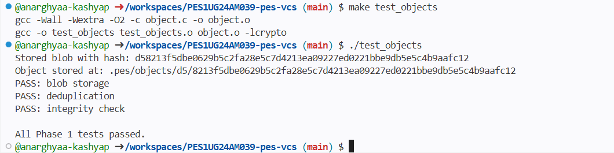
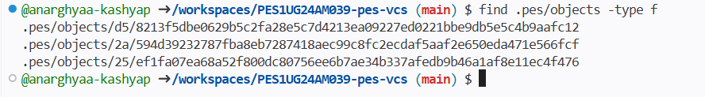
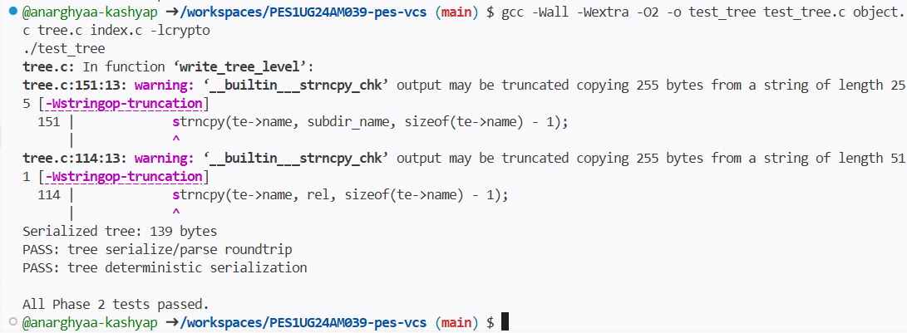
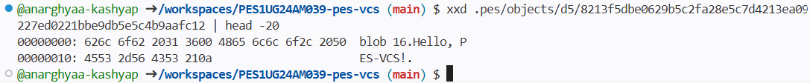
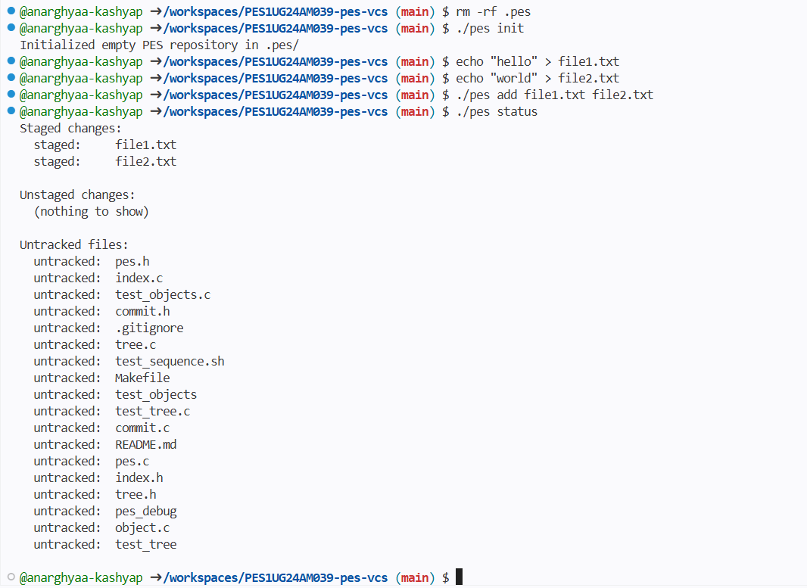
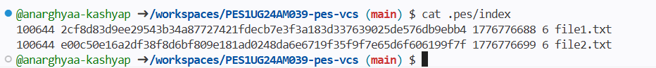
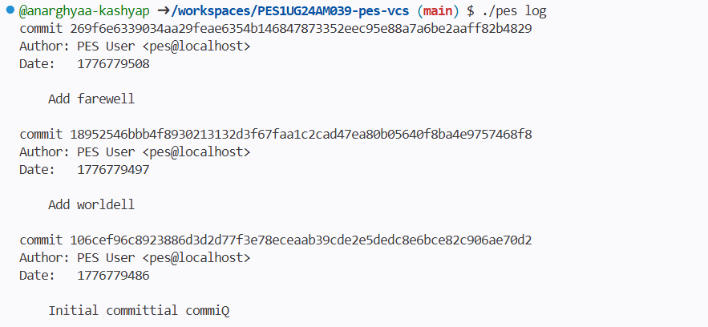
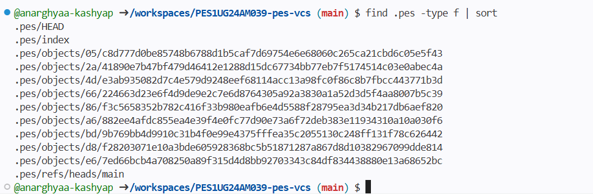
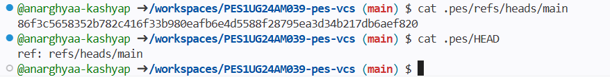
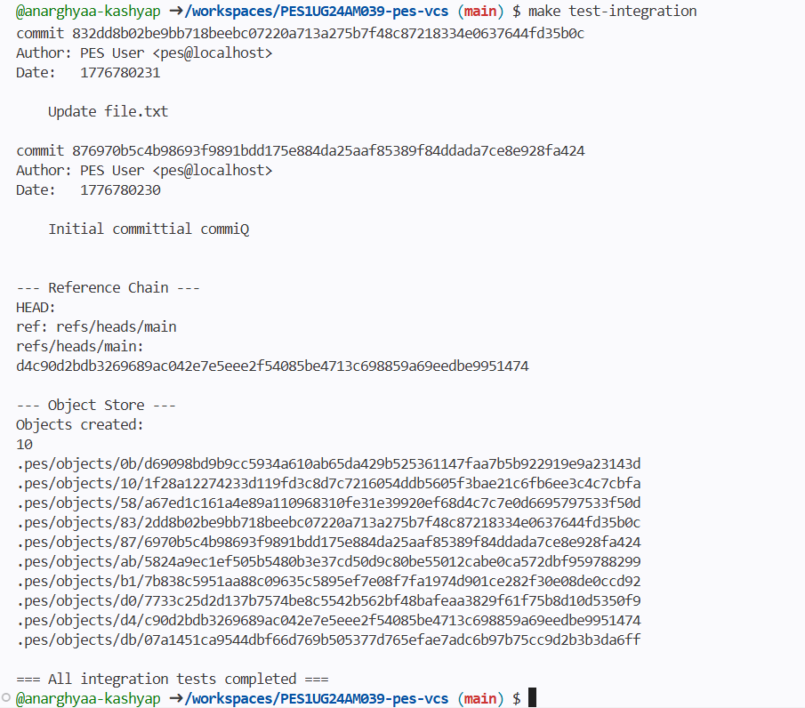

# Screenshots

## Phase 1

### 1A - test_objects output

### 1B - Sharded directory structure

## Phase 2

### 2A - test_tree output

### 2B - Raw binary tree object

## Phase 3

### 3A - pes init, add, status sequence

### 3B - cat .pes/index

## Phase 4

### 4A - pes log showing three commits

### 4B - find .pes -type f output

### 4C - refs/heads/main and HEAD

## Final - Integration Test

